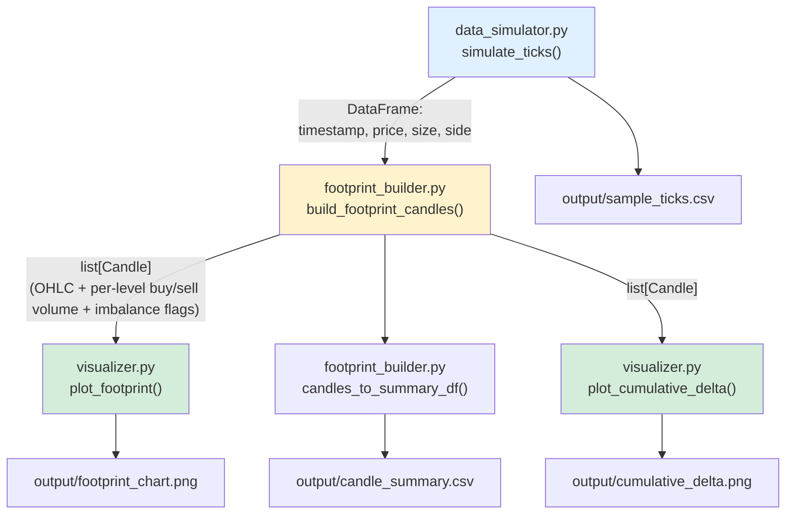

# Architecture

## Data flow

`main.py` is the orchestrator that calls each stage in order and writes
everything to `output/`.

## Module responsibilities

| module | responsibility | depends on |
|---|---|---|
| `data_simulator.py` | Produces tick data matching the schema `(timestamp, price, size, side)`. This is the only module you'd replace to plug in a real feed. | numpy, pandas |
| `footprint_builder.py` | Pure data transformation: raw ticks → `Candle` objects, each holding OHLC, delta, total volume, and a `price → {buy, sell}` map. Also flags imbalance levels. No plotting, no I/O beyond the `__main__` demo block. | pandas |
| `visualizer.py` | Takes `Candle` objects and renders matplotlib charts. Has no knowledge of how the ticks were generated — only depends on the `Candle` dataclass. | matplotlib |
| `main.py` | Orchestrates the pipeline end-to-end and manages output paths. | all of the above |

## Why this split

The three-stage split (simulate → aggregate → visualize) mirrors how
you'd structure this against a real feed: a **data ingestion layer**
(swap `data_simulator` for a WebSocket client), a **pure aggregation
layer** that's easy to unit test since it has no I/O or plotting side
effects, and a **presentation layer** that only depends on the
`Candle` schema, not on where the data came from.

## Key design decisions

- **Volume-based candles, not time-based.** `ticks_per_candle` groups a
  fixed number of trades per candle instead of a fixed time window, so
  candle "size" stays comparable across quiet and volatile periods —
  standard practice for footprint charts, where you want each printed
  candle to represent roughly comparable activity.
- **Separate `tick_size` and `level_size`.** Raw price precision
  (`tick_size`, e.g. 0.05) is decoupled from the footprint's display
  resolution (`level_size`, e.g. 0.25). Without this, a volatile candle
  can span hundreds of raw price levels, making the printed grid
  unreadable — aggregating to a coarser grid for display is what real
  footprint tools do.
- **Imbalance flagged at build time, not render time.** `Candle.imbalance_levels`
  is computed once in `footprint_builder.py` so the same `Candle` objects
  could feed a backtester or alerting logic later without re-deriving
  imbalance from scratch in the plotting code.
